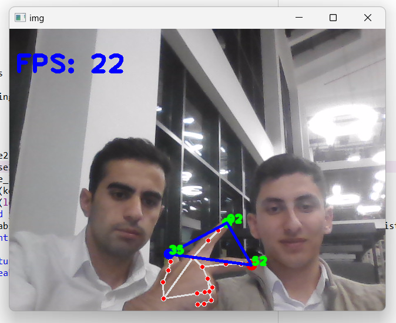

# Finding-Angle-with-Hand-Tracking-
  Herkese merhabalar bugünkü projemizde mediapipe ve  OpenCV kullanarak hand estimation ile parmak uçlarımız ile oluşan üçgenin açılarını bulacağız.
  Daha önce birçoğunuz hand estimation yapmışşınızdır ama bunu kullanarak ileri seviye ne gibi görüntü işleme projeleri yapabiliriz sorusuna bir cevap niteliğinde bu repoyu hazırladık.



Resimde de görüldüğü gibi parmak uçlarımızla oluşturduğumuz üçgenin açıları dahi başarılı bir şekilde hesaplanmıştır. İsterseniz 180 dereceyi bile deneyebilirsiniz :)

Gelin yazılımı birlikte test edelim. İlk olarak repoyu klonlayalım.
```shell

git clone https://github.com/openytu/Finding-Angle-with-Hand-Tracking-
```
Şimdi yazılımı çalıştırabiliriz.
```shell

python el_takibiyle_acı_bulma.py 

```

Github repomuzdaki görüntü işleme ve bilgisayarlı görü alanlarında tarafımızca yazılan yazılımları kendi projelerinizde de kaynak göstererek gönül rahatlığıyla kullanabilirsiniz.
